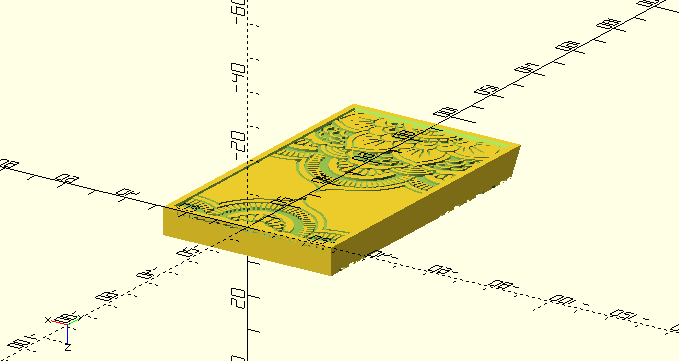

# Business Card Mandala Case

Based on the pictures of [this item from thingiverse](https://www.thingiverse.com/thing:340478),
this is a business card holder with a pleasing mandala pattern (tailored to match my wife's
business cards). It has small detents on the lid and is meant to be printed with a somewhat rigid
resin.

Tested with OpenSCAD 2021.01

## Building Instructions

To make STLs, simply run `make` in this folder. Requires OpenSCAD to be in the path.

## Printing

This model prints best on an SLA printer. Plate it at an angle, according to the formula
`atan(h/d)` where `h` is the layer height and `d` is the pixel size. On my printer, this angle is
55 degrees for a 50um layer height, given that my printer's pixel size is 35um.

## Preview

